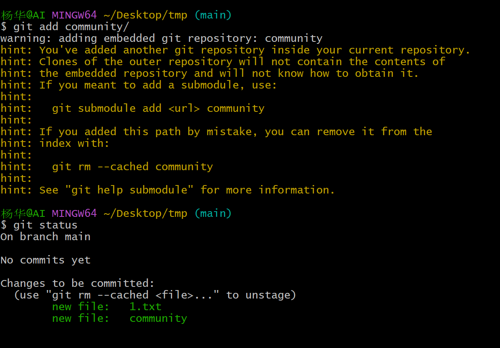

# git学习

创建一个文件夹，然后执行：`git init` （创建一个仓库）
通过`git clone url `这样就可以获取到gethub项目的源代码。
通过`git add file_name` 这样就可以将文件添加到`git仓库中`,如果需要将新的文件加入到仓库里面，
也是使用同样的命令。
`git status` 查看仓库状态

# git创建分支

在创建分支之前需要提交还要有描述：`git commit file_name -m "描述信息"`
然后就可以是哟`git log `查看日志信息

在进行以上操作之后就可以创建分支了，通过`git branch "描述"`,这样就创建了一个分支，然后可以通过`git checkout "描述" `选择分支。

`git merge branch_name`:进行合并

